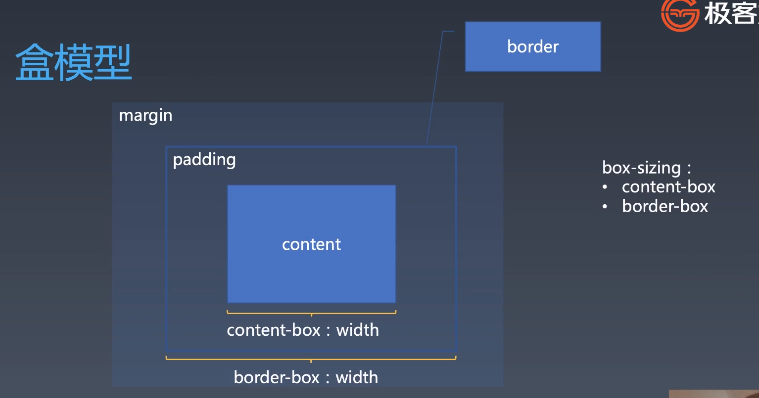

# 每周总结可以写在这里

## 重学 CSS - 选择器

### 选择器语法

- 简单选择器

  - \* universal
  - div `svg|a` namespace 命名空间
  - .cls 类选择器
  - #id 完全匹配
  - [attr=value] 属性选择器 ~ |
  - :hover
  - ::before 伪元素选择器

- 复合选择器

  - <简单选择器><简单选择器><简单选择器>
  - \* 或者 div 必须写在最前面

- 复杂选择器

  - <复合选择器>< sp><复合选择器>
  - <复合选择器>">"<复合选择器>
  - <复合选择器>"~"<复合选择器>
  - <复合选择器>"+"<复合选择器>
  - <复合选择器>"||"<复合选择器> 选学
  - 选择器列表 逗号分隔

### 选择器优先级

学习的目的：对事物有一定判断的价值观，而不是判断的结论  

优先级就是分配给指定的 `CSS` 声明的一个权重，它由匹配的选择器中的每一种选择器类型的数值决定

- 简单选择器

```text
#id div.a#id {
  //...
}
```

> [0,2,1,1]  
> \* 0;  
> #id 2;  
> . 1;  
> div 1;  
> 采用进制的方法去计算优先级

### 伪类

- 链接/行为
  - :any-link
  - :link :visited
  - :hover
  - :active
  - :focus
  - :target

- 树结构
  - :empty
  - :nth-child()
  - :nth-last-child() 不推荐
  - :first-child :last-child 不推荐:only-child 不推荐

- 逻辑型
  - :not伪类
  - :where :has

### 伪元素

- ::before 重要
- ::after 重要
- ::firstLine
- ::firstletter

## 重学 CSS - 排版

- 排版
- 渲染
- 交互

### 排版

#### 盒(Box)

- 标签 Tag 源代码
- 元素 Element 语义
- 盒 Box 表现

课堂练习：
HTML代码中可以书写开始`标签`，结束`标签`，和自封闭`标签`。
一对起止标签，表示一个`元素`。
DOM树中存储的是`元素`和其他类型的节点(NOde).
CSS选择器选中的是`元素`。
CSS选择器选中的是`元素`，在排版时可能会产生多个`盒`。
排版和渲染的基本单位是`盒`。

### 盒模型



box-sizing

- content-box
- border-box

### 正常流 normal flow

- 80年代印刷厂工人在进行排版工作

- 我们如何写字
  - 从左到右书写
  - 同一行写的文字都是对齐的
  - 一行写满了，就换到下一行

#### 正常流排版

- 收集盒进行
- 计算盒在行中的排布
- 计算行的排布

`inline-box` `line-box` `block-box`

IFC 从左到右
BFC 从上到下

#### 正常流的行模型 IFC

- 基线 （中文没有基线概念）
- 行高
- 正常流的基线会因为有没有文字发生变化，以文字的底部为基线
  - 一般会给一个 vertical-align:bottom

#### flaot与clear

float会脱离文档流，一般有文字绕排会使用float

float：right //如果右边已经有float对象，则会导致对象堆积
clear：right //找个干净的地方放置
inline-block

#### margin折叠

只会发生在BFC中，即上下方向上

- margin 留白，只用周围满足条件即可，不是边距想加
- overflow:hidden 当做是一个新的容器，产生折叠；特殊的是，overflow的里外都是BFC，满足需要就行，会产生折叠
- inline-block 单独作为一个容器，产生折叠

| block level |              |                 |
| ----------- | ------------ | --------------- |
| flex        | inline-flex  |                 |
| table       | inline-table |                 |
| grid        | inline-grid  |                 |
| block       | inline-block | block container |

- inline
- run-in

### 复习：Flex排版

- 收集盒进行
- 计算盒在主轴方向的排布
- 计算盒在交叉轴方向的排布

## 参考文档

- [CSS 优先级](https://developer.mozilla.org/zh-CN/docs/Web/CSS/Specificity)
- [Selector Level 3](https://www.w3.org/TR/selectors-3/)
- [BFC](https://developer.mozilla.org/zh-CN/docs/Web/Guide/CSS/Block_formatting_context)
  - 块格式化上下文（Block Formatting Context，BFC） 是 Web 页面的可视 CSS 渲染的一部分，是块盒子的布局过程发生的区域，也是浮动元素与其他元素交互的区域

- [Flex-items](https://www.w3.org/TR/2018/CR-css-flexbox-1-20181119/#flex-items)
- [freeType](https://www.freetype.org/)
